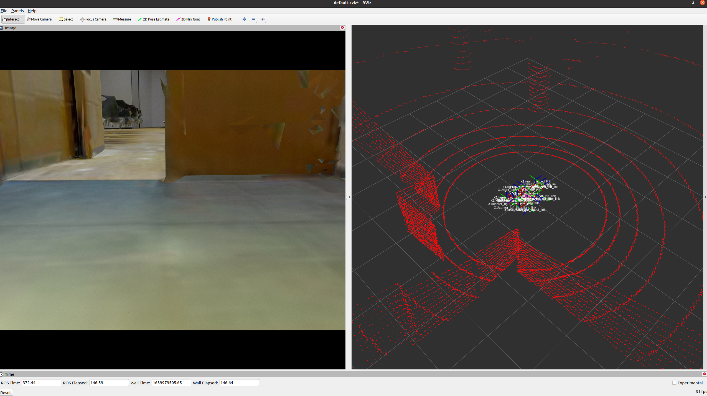
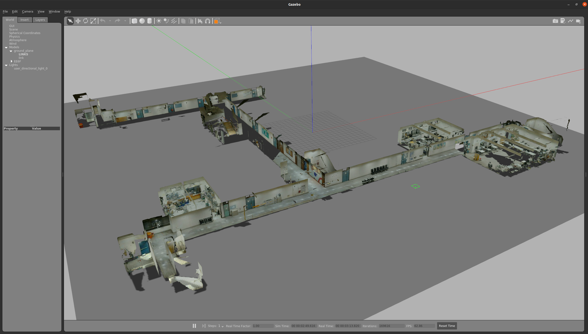
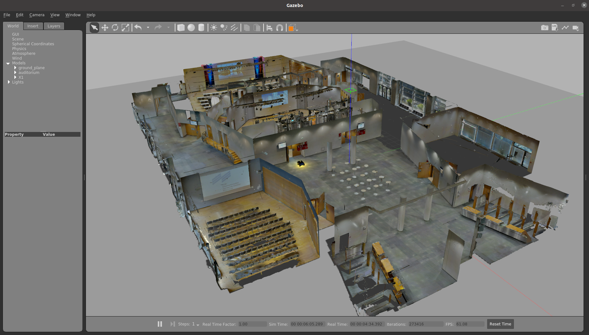
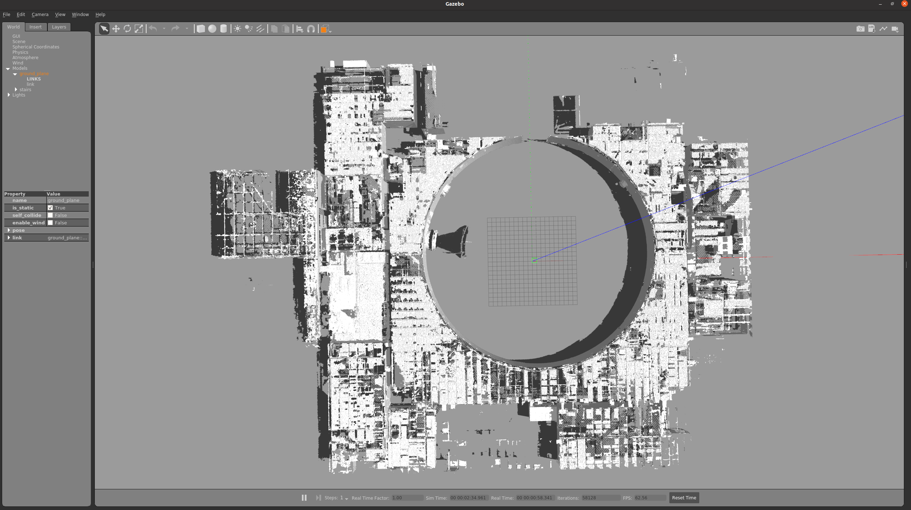
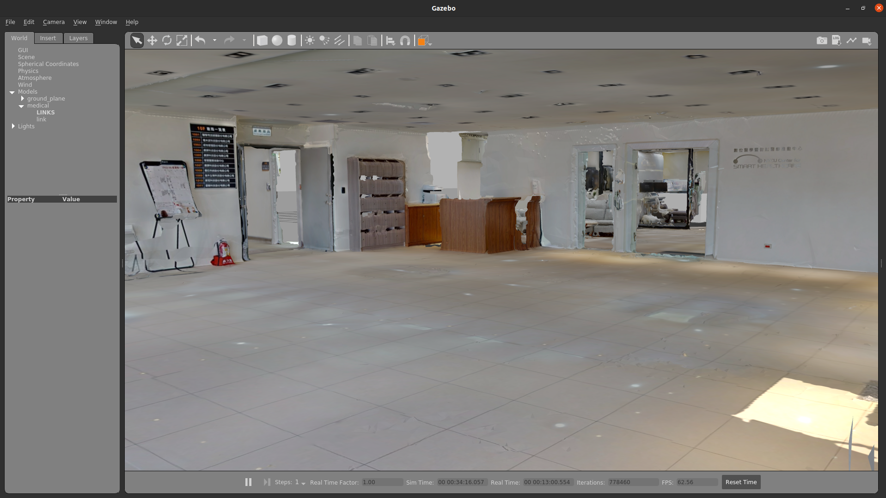
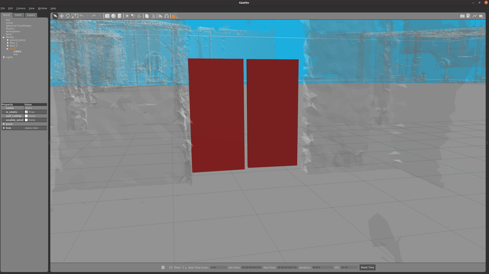

# real_to_sim_env
This is a ROS package for the some simulation environments (gazebo world).

Then, you can spawn the robot into the world.

## Download Mesh
`cd mesh`

`source download_environments.sh`

## Launch Env
<!-- ### NCTU EE6F
`roslaunch real_to_sim_env gazebo_world.launch world:=EE6F`

 -->

### auditorium
`roslaunch real_to_sim_env gazebo_world.launch world:=auditorium`

### urban
`roslaunch real_to_sim_env gazebo_world.launch world:=urban`

### medical (link)[https://www.youtube.com/watch?v=NC4VnzS7ABU&ab_channel=DaveWu]
`roslaunch real_to_sim_env gazebo_world.launch world:=medical`

<!-- ### urban with door

This world also need this ROS package [dynamic_gazebo_models](https://github.com/kuolunwang/dynamic_gazebo_models.git)

`roslaunch real_to_sim_env gazebo_world.launch world:=urban_with_door`

 -->
